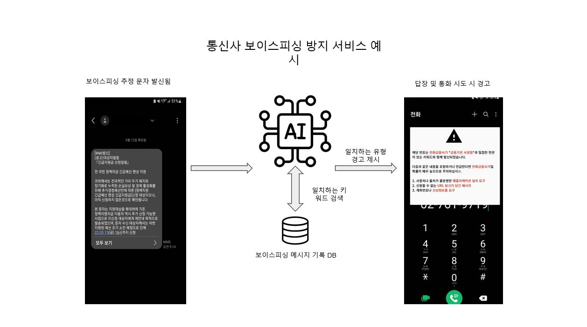
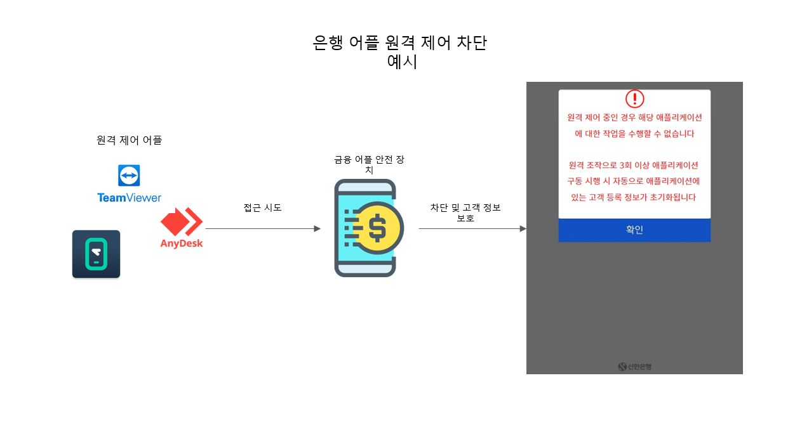
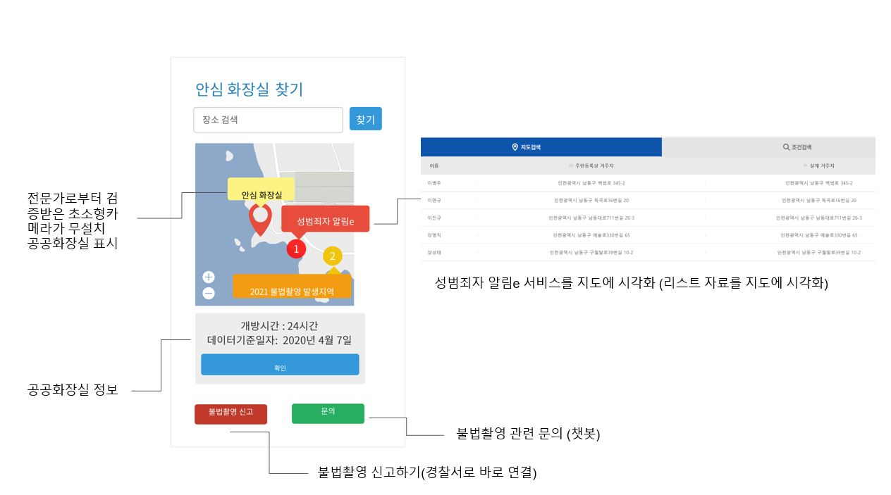
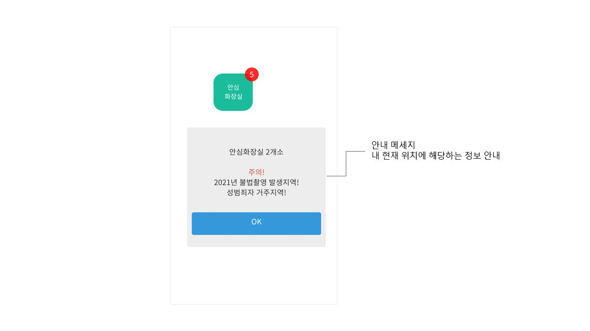
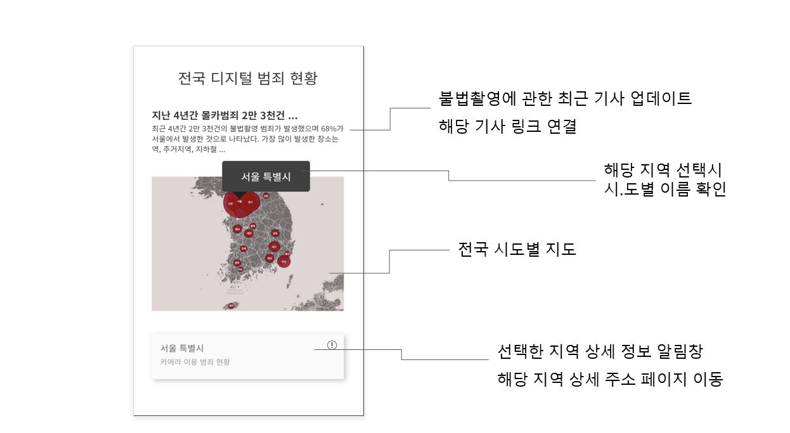
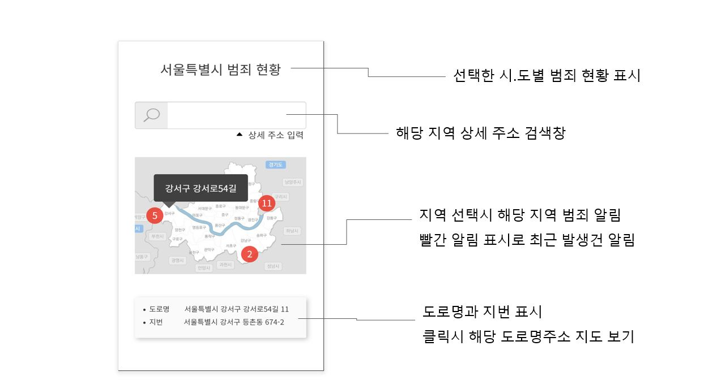
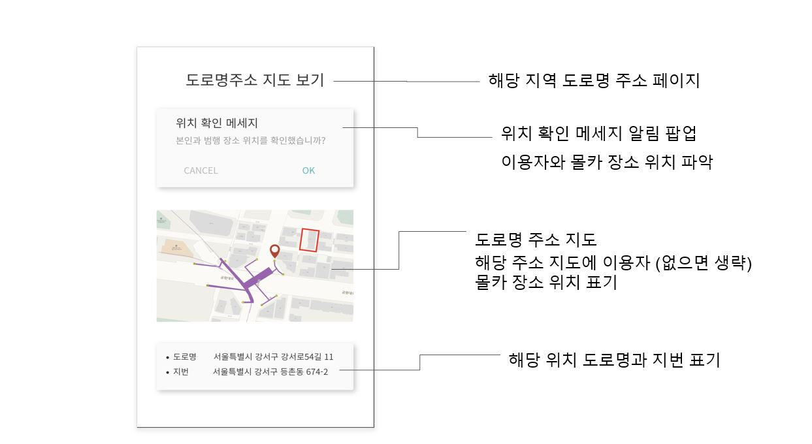
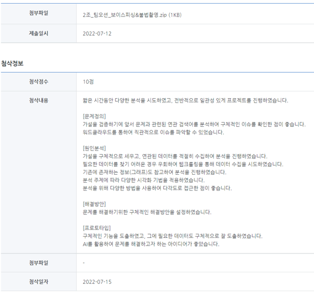

  
<h1 align="center">
  
 💡 데이터 기반 문제해결 프로젝트 

 </h1>

 
 

## 💡 Introduction

- **개발 기간**
  > 2022.07.06 ~ 2022.07.12

- **프로젝트 목적**
  > 프로토타입 제작 (서비스구조, 데이터흐름, 간단한 화면설계)

- **프로젝트 주제**
  > 보이스 피싱 & 불법촬영

- **개발 환경**
  > Python, Jupyter Notebook, Visual Studio, R

- **팀명**
  > 팀오션 (팀원들이 바다를 좋아해서...)

- **팀원**
  > 6명

- **주요 업무 및 상세역할**
  > 데이터수집(네이버 뉴스기사 웹크롤링), 워드클라우드(기사제목), 시각화(그래프)

  
  

## ✅ Completion

### 보이스 피싱
- **서비스 개요**
  > 서비스 이름 : 보이스 피싱 감지 시스템
  
  > 서비스 대상 : 모바일 뱅킹 사용자
  
  > 서비스 목적 : 별도의 어플리케이션 추가 설치없이 보이스 피싱 예방 효과 강화
  
- **주요 기능** 
  > 금융사 APP
    > - 지연시간 설정
    > - 이체 시 사전 경고
    > - 서비스 제한

  > 통신사 지원
    > - 경고 문자 메세지
    > - APP 설치 차단
  
- **데이터 설계** 
  > 계좌 거래 내역
    > - 기존 거래 내역을 이용해 고객과 접점이 없는 계좌 번호에 이체하는 경우를 대비

  > 고객 연락처 정보
    > - 위와 같은 이유

  > 전자금융사기 메세지 내용
    > - 보이스피싱에 이용되는 키워드로 해당 메시지 내용이 보이스피싱과 밀접한지 아닌지를 판단

- **주요 화면** 
> 
> 

- **기대 효과** 
  > 정보 취약 계층도 편리한 모바일 뱅킹을 안전하게 사용할 수 있도록 함
  > - 별도의 추가 APP 을 설치하는 것이 아니라 기존 APP 에 기본 기능으로 추가
  > - 사용자 휴대폰에 새로운 무언가 설치되어 감시한다는 불쾌감을 주지 않음
  > - 피의자가 원격 조작 시 쉽게 삭제하거나 눈치챌 수 없음
  > - 기존에 개발 상용화 된 보안 어플등을 추가 설치하는 번거로움이 줄어듬

### 불법촬영
- **서비스 개요**
  > 서비스 이름 : 안심 화장실 찾기 서비스
  
  > 서비스 대상 : 
   > - 불법촬영에 대한 우려가 있어 공공화장실 사용이 꺼려지는 일반 여성
   > - 미성년 자녀를 둔 부모님
  
  > 서비스 목적 : 
    > - 불법촬영의 우려가 없는 안심하고 사용할 수 있는 공공화장실 찾기
    > - 지도에서 한번에 파악하는 불법촬영 장소 위치 성범죄자 정보
  
- **주요 기능** 
  > 공공화장실 초소형카메라 설치 검사 확인
    > - 공공화장실 대상으로 초소형카메라 설치유무를 검사한 내용을 지도에 업데이트
    > - 예) 2022 년 11 월 7 일 점검
   

  > 문의
   > - 즉각적이고 편리한 문의 서비스 챗봇

  > 성범죄자 위치 지도에 표시
   > - 리스트화 된 성범죄자 알림 e 서비스를 지도에 시각화

  > 세분화된 지도에 불법촬영 장소 및 위치 표시
    > - 전국 단위 지도에서부터 도로명 주소까지 선택한 지역의 불법촬영 현황과 장소를 표시해 해당 정보 전달

- **데이터 설계** 
  > 공중화장실 정보
    > - 12_04_01_E_공중화장실정보.xlsx [출처 : 전국공중화장실표준데이터]
    > - 공중화장실의 데이터에 초소형카메라 설치유무 검사를 추가한 새로운 데이터를 생성 필요
    > - 몰카탐지기를 이용하여 검사유무를 기록한 추가적인 데이터 수집 필요

  > 경찰청 카메라등이용촬영범죄 지역별 발생 현황
    > - 불법촬영 발생지역 상세 주소 데이터
    > - 발생지역의 상세주소까지 공개된 데이터 필요

  > 성범죄자 알림 e
    > - 전국 구 단위별 거주 성범죄자 이름과 상세주소

  > 내 위치 정보
    > - 내 위치정보를 토대로 주변의 안심화장실, 불법촬영 발생지역, 성범죄자 거주지역 알림

- **주요 화면** 
> 
> 
> 
> 
> 

- **기대 효과** 
  > 불안없이 공공화장실 이용하기
    > - 공공화장실 카메라 설치유무 확인 검증이 이루어진 곳 지도에 표시

  > 보다 편리하고 효과적인 불법촬영 발생지역 및 성범죄자 거주지역 정보 파악
    > - 과거 범죄 발생지역은 재발이 이루어지지 않도록 더욱 주의를 기울임
    > - 지도에 성범죄자의 거주지가 표시되어 보다 효과적으로 정보를 파악하여 범죄를 예방하는 효과를 도모하고자 함
    > - 사용자가 촬영범죄 현황을 파악하고자 하는 지역을 선택하고 해당 지역에 대한 상세 주소와 위치 정보를 지도에 표시해 재발 방지

  
  

## 👏 Evaluation
- 팀원 간 평가의견
  >  새롭게 느낀 점
   > - 전체적인 과정을 실제적으로 해보아서 좋은 경험

  > - 디자인씽킹을 통하여 데이터를 분석하는 이유가 더 명확해졌고 얻고자 하는것이 무엇인지 더 분명해짐

  > - 디자인씽킹을 통하여 문제 정의 해결방안을 도출하여 좋은 결과물을 얻을 수 있었음

  >  어려웠던 점
     > - 우리가 찾고자하는 범죄 관련 정확한 데이터를 찾기 힘들었음
     > - 가설검증을 위한 시각화 코딩으로 한번에 시각화 자료를 얻지 못했지만, 시행착오를 통하여 좋은 결과를 도출

   >  프로토타입 실행 방안
   > - 공공화장실에 담당 관리기관에 불법촬영 탐지 서비스 요구
   > - 샘플 공공화장실에 현장 불법촬영 탐지 일시 데이터 공개 필요설문조사 결과물 --> 담당기관에 전달 데이터
요청
  > - 지역별 카메라이용범죄 현황에 대한 상세 주소 데이터 요청

  >  개선하고 싶은 점
    > -  동일한 주제 프로젝트로 여러 팀간의 다양한 구현 방식을 해보는것도 좋겠다는 생각을 해보았습니다.

  

- 김자영 지도강사 평가의견
  > [파이썬, 데이터 분석 전문 강사](https://sesac.seoul.kr/course/active/detail.do)

  > 
